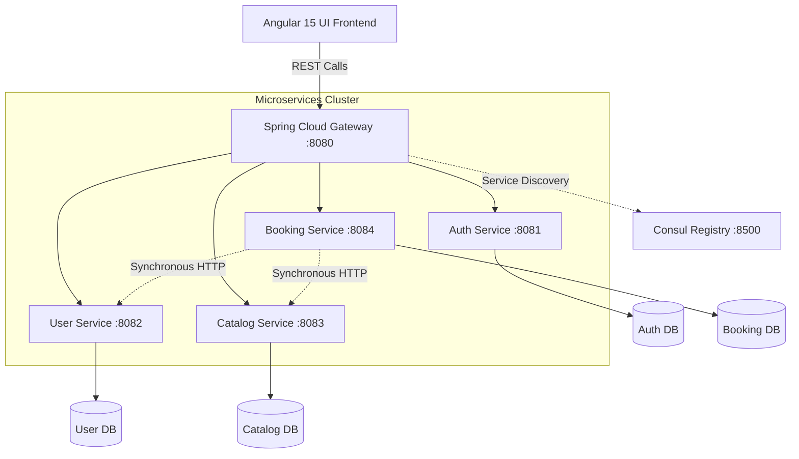

<h1 align="center">🚗 Car Service Booking System</h1>

<p align="center">
  
  
  
  
  
</p>

<p align="center">
  <strong>A modern, highly scalable Full-Stack Microservices Application for streamlining automotive maintenance and booking workflows.</strong>
</p>

---

## 📖 Table of Contents
- [About The Project](#-about-the-project)
- [System Architecture](#-system-architecture)
- [Key Features](#-key-features)
- [Tech Stack](#-tech-stack)
- [Getting Started](#-getting-started)
- [API Design & Security](#-api-design--security)
- [License](#-license)

---

## 🚀 About The Project

The **Car Service Booking System** is an enterprise-grade web application designed to digitalize the automotive service industry. It provides a robust, role-based platform allowing **Customers** to manage their vehicle fleets and seamlessly book service appointments, while empowering **Administrators** to oversee service catalogs, track booking lifecycles, and monitor system-wide analytics via a comprehensive dashboard.

Developed strictly adhering to **Domain-Driven Design (DDD)** and the **Database-per-Service** pattern, the backend ensures loose coupling, high availability, and fault tolerance across its domains.

---

## 🏗 System Architecture

The application is built on a highly decoupled **Microservices Architecture**. 

- **Spring Cloud Gateway** handles dynamic routing and cross-origin (CORS) configurations.
- **Spring Cloud Consul** provides automated service discovery and health monitoring.
- **Resilience4j Circuit Breakers** prevent cascading failures during inter-service synchronous communication.



---

## ✨ Key Features

### 👤 Customer Portal
- **Profile & Fleet Management:** Register, update personal details, and manage multiple vehicles.
- **Smart Booking Flow:** Browse active service packages, filter by category, and schedule non-conflicting appointments.
- **Real-Time Tracking:** Monitor the precise status of active bookings (e.g., `PENDING` ➔ `IN_SERVICE` ➔ `COMPLETED`).
- **Personalized Dashboard:** View historical service data and active vehicle metrics.

### 🛡️ Administrator Portal
- **Catalog Operations:** Create, update, and toggle the availability of service categories and specific service packages.
- **Strict Workflow Management:** Advance booking states through a rigorously validated operational pipeline.
- **Analytics Dashboard:** Monitor cross-service aggregated data including total customers, active bookings, and total generated revenue/services.
- **Advanced Reporting:** Search, filter, and paginate through historical booking records.

---

## 💻 Tech Stack

### Backend
* **Java 21** & **Spring Boot 3.x**
* **Spring Data JPA** & **Hibernate**
* **Spring Cloud Gateway** & **Spring Cloud Consul**
* **Resilience4j** (Circuit Breaker implementation)
* **ModelMapper** & **Lombok**
* **MySQL** (RDBMS)

### Frontend
* **Angular 15+** & **TypeScript**
* **RxJS** (Reactive programming)
* **Bootstrap 5** (Responsive UI/UX design)
* **HTML5** & **CSS3**

---

## 🛠 Getting Started

### Prerequisites
* **JDK 21** installed and configured.
* **Node.js** & **Angular CLI** installed globally.
* **MySQL** running on default port `3306`.
* **HashiCorp Consul** running on default port `8500`.

### Installation & Execution

1. **Start Consul:**
   ```bash
   consul agent -dev
   ```

2. **Initialize Databases:**
   Ensure MySQL is running and the following empty databases exist:
   `auth_db`, `user_db`, `catalog_db`, `booking_db`.
   *(Hibernate will automatically generate the schema upon startup).*

3. **Run Microservices:**
   Navigate to each microservice directory and run the Spring Boot applications in the following order:
   ```bash
   # 1. Gateway
   mvn spring-boot:run
   
   # 2. Domain Services
   mvn spring-boot:run
   ```

4. **Launch Frontend:**
   ```bash
   cd frontend/angular-app
   npm install
   ng serve
   ```
   Navigate to `http://localhost:4200` in your browser.

---

## 🔒 API Design & Security

To ensure maximum performance and minimize architectural bloat, this project omits heavy security frameworks like OAuth2 or JWTs. 
Instead, it utilizes a highly efficient **Header-Based Role System**:
- The **Auth Service** validates credentials and initializes the session.
- The Angular frontend attaches `X-User-Id` and `X-User-Role` headers to subsequent HTTP requests via Interceptors.
- Downstream microservices enforce authorization policies programmatically based on these injected headers, ensuring a secure, stateless inter-service pipeline.

---

<p align="center">
  <em>Crafted with precision for modern software engineering standards.</em>
</p>
